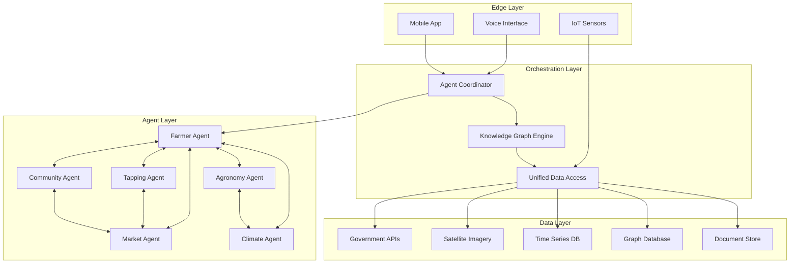
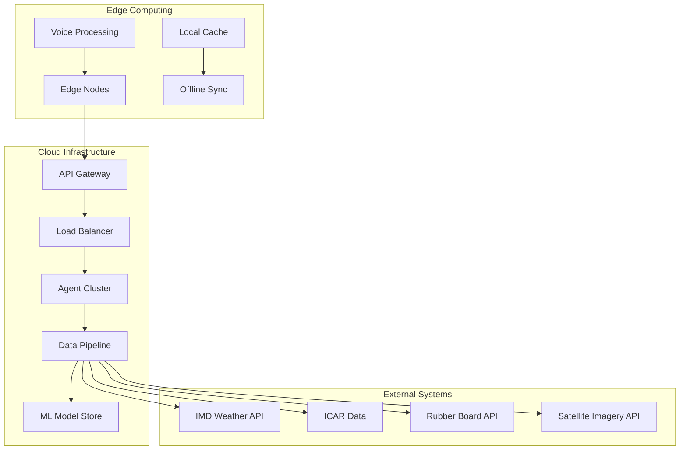
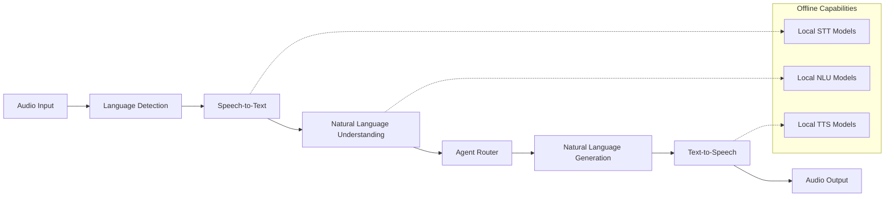

# Design Document

## Overview

PlantAI is a sophisticated multi-agent AI system designed to revolutionize India's plantation sector through intelligent automation, voice-first interfaces, and comprehensive data integration. The system employs a hybrid coordinator-swarm architecture where specialized agents collaborate through a central knowledge graph while maintaining autonomous decision-making capabilities.

The architecture prioritizes rural accessibility through multilingual voice processing, offline-first design, and edge computing deployment. The system integrates real-time data from government APIs, IoT sensors, and satellite imagery to provide actionable insights for plantation optimization, mechanized operations, and community management.

Key design principles include:
- **Voice-First Experience**: Natural language interaction in 6 Indian languages with <3 second response times
- **Agent Specialization**: Six domain-specific agents with clear responsibilities and expertise
- **Hybrid Deployment**: Cloud analytics with edge processing for real-time responses
- **Data Integration**: Unified access to government datasets, IoT streams, and satellite imagery
- **Community Focus**: Cooperative management tools and participatory decision-making systems

## Architecture

### System Architecture Pattern

The system follows a **Hybrid Coordinator-Swarm** architecture that combines centralized orchestration with peer-to-peer agent collaboration:



### Communication Patterns

The system employs multiple communication patterns based on research findings:

1. **Direct Messaging (89% of use cases)**: Agent-to-agent communication for specific requests
2. **Shared State**: Knowledge graph for collaborative data access
3. **Pub/Sub**: Event broadcasting for system-wide notifications
4. **Negotiation**: Conflict resolution when agents provide contradictory recommendations

### Deployment Architecture



## Components and Interfaces

### Agent Coordinator

**Purpose**: Central orchestration and conflict resolution
**Technology**: Python FastAPI with async/await patterns
**Key Responsibilities**:
- Route user requests to appropriate agents
- Resolve conflicts between agent recommendations
- Maintain system health and performance monitoring
- Handle authentication and security

**Interface**:
```python
class AgentCoordinator:
    async def route_request(self, request: UserRequest) -> AgentResponse
    async def resolve_conflicts(self, responses: List[AgentResponse]) -> UnifiedResponse
    async def monitor_agent_health(self) -> SystemHealth
    async def authenticate_user(self, credentials: UserCredentials) -> AuthToken
```

### Knowledge Graph Engine

**Purpose**: Central data relationship management and semantic reasoning
**Technology**: Neo4j with Python driver
**Key Responsibilities**:
- Store relationships between farmers, crops, equipment, and market data
- Enable semantic queries across all system data
- Maintain data consistency and integrity
- Support real-time updates and propagation

**Schema Design**:
```cypher
// Core entities
CREATE (f:Farmer {id, name, location, languages, cooperative_id})
CREATE (p:Plantation {id, farmer_id, type, area, coordinates})
CREATE (c:Crop {id, name, variety, planting_date, expected_harvest})
CREATE (e:Equipment {id, type, status, location, maintenance_schedule})
CREATE (m:Market {id, location, commodity_types, price_history})

// Relationships
CREATE (f)-[:OWNS]->(p)
CREATE (p)-[:GROWS]->(c)
CREATE (f)-[:USES]->(e)
CREATE (c)-[:SOLD_AT]->(m)
```

### Voice Processing Pipeline

**Purpose**: Multilingual speech-to-speech processing with agricultural domain understanding
**Technology**: Whisper (STT), spaCy + custom NLU models, Festival TTS
**Architecture**: Cascade system with language detection followed by specialized processing



**Interface**:
```python
class VoicePipeline:
    async def process_speech(self, audio: AudioStream, user_context: UserContext) -> VoiceResponse
    async def detect_language(self, audio: AudioStream) -> Language
    async def speech_to_text(self, audio: AudioStream, language: Language) -> str
    async def understand_intent(self, text: str, language: Language) -> Intent
    async def generate_response(self, intent: Intent, agent_response: AgentResponse) -> str
    async def text_to_speech(self, text: str, language: Language) -> AudioStream
```

### Specialized Agents

#### Farmer Agent
**Purpose**: Primary interface and conversation management
**Technology**: Python with conversational AI framework
**Key Capabilities**:
- Maintain conversation context and user preferences
- Route complex queries to specialized agents
- Provide unified responses from multiple agents
- Handle authentication and user session management

#### Agronomy Agent
**Purpose**: Crop recommendations and diversification strategies
**Technology**: Python with TensorFlow/PyTorch for ML models
**Key Capabilities**:
- Analyze soil conditions and climate data
- Recommend optimal crop varieties and planting schedules
- Suggest diversification strategies based on market conditions
- Provide organic and sustainable farming guidance

#### Tapping Agent
**Purpose**: Mechanized tapping optimization
**Technology**: Python with optimization algorithms
**Key Capabilities**:
- Schedule tapping operations based on tree maturity and weather
- Coordinate mechanized equipment across multiple plantations
- Optimize routes and resource allocation
- Predict maintenance needs and schedule downtime

#### Market Agent
**Purpose**: Market intelligence and supply chain optimization
**Technology**: Python with real-time data processing
**Key Capabilities**:
- Track commodity prices across multiple markets
- Predict optimal selling windows
- Connect farmers with buyers
- Analyze supply chain efficiency

#### Community Agent
**Purpose**: Cooperative management and community engagement
**Technology**: Python with workflow management
**Key Capabilities**:
- Facilitate digital voting and decision-making
- Manage shared resource scheduling
- Coordinate training and education programs
- Handle conflict resolution and mediation

#### Climate Agent
**Purpose**: Climate analysis and sustainability recommendations
**Technology**: Python with climate modeling libraries
**Key Capabilities**:
- Process satellite imagery and weather data
- Provide climate-aware farming recommendations
- Track sustainability metrics and carbon sequestration
- Issue early warnings for extreme weather

### Data Integration Layer

**Purpose**: Unified access to all external data sources
**Technology**: Python with Apache Kafka for streaming, REST APIs for batch processing

**Data Sources**:
- **Government APIs**: IMD (weather), ICAR (research), Rubber Board (market data)
- **IoT Sensors**: Soil moisture, temperature, humidity, equipment status
- **Satellite Imagery**: Landsat-8, Sentinel-2 for vegetation indices and crop health
- **Market Data**: Commodity exchanges, local market prices, supply chain data

**Interface**:
```python
class DataIntegrationLayer:
    async def get_weather_data(self, location: Coordinates, date_range: DateRange) -> WeatherData
    async def get_satellite_imagery(self, plantation_id: str, date: Date) -> SatelliteImage
    async def get_market_prices(self, commodity: str, market: str) -> PriceData
    async def stream_iot_data(self, sensor_ids: List[str]) -> AsyncIterator[SensorReading]
    async def get_government_data(self, api: str, params: Dict) -> GovernmentData
```

## Data Models

### Core Domain Models

```python
from dataclasses import dataclass
from datetime import datetime
from typing import List, Optional, Dict
from enum import Enum

class PlantationType(Enum):
    RUBBER = "rubber"
    TEA = "tea"
    COFFEE = "coffee"
    SPICES = "spices"

class Language(Enum):
    HINDI = "hi"
    TAMIL = "ta"
    MALAYALAM = "ml"
    BENGALI = "bn"
    KANNADA = "kn"
    TELUGU = "te"

@dataclass
class Farmer:
    id: str
    name: str
    phone: str
    location: Coordinates
    preferred_language: Language
    cooperative_id: Optional[str]
    registration_date: datetime
    verification_status: bool

@dataclass
class Plantation:
    id: str
    farmer_id: str
    plantation_type: PlantationType
    area_hectares: float
    coordinates: Coordinates
    soil_type: str
    planting_date: datetime
    tree_count: int
    current_crops: List[str]

@dataclass
class VoiceInteraction:
    id: str
    farmer_id: str
    timestamp: datetime
    language: Language
    audio_duration: float
    transcript: str
    intent: str
    agent_responses: List[AgentResponse]
    satisfaction_score: Optional[float]

@dataclass
class AgentResponse:
    agent_id: str
    response_text: str
    confidence_score: float
    data_sources: List[str]
    recommendations: List[Recommendation]
    timestamp: datetime

@dataclass
class Recommendation:
    type: str
    description: str
    priority: int
    expected_impact: str
    implementation_steps: List[str]
    cost_estimate: Optional[float]

@dataclass
class IoTSensorReading:
    sensor_id: str
    plantation_id: str
    timestamp: datetime
    sensor_type: str
    value: float
    unit: str
    quality_score: float

@dataclass
class MarketData:
    commodity: str
    market_location: str
    price_per_kg: float
    timestamp: datetime
    volume_traded: float
    price_trend: str
    source: str

@dataclass
class WeatherData:
    location: Coordinates
    timestamp: datetime
    temperature: float
    humidity: float
    rainfall: float
    wind_speed: float
    pressure: float
    forecast_confidence: float

@dataclass
class SatelliteAnalysis:
    plantation_id: str
    image_date: datetime
    vegetation_index: float
    crop_health_score: float
    water_stress_level: float
    anomaly_detected: bool
    analysis_confidence: float
```

### Database Schema Design

#### Time Series Database (InfluxDB)
```sql
-- IoT sensor measurements
CREATE MEASUREMENT sensor_readings (
    time TIMESTAMP,
    sensor_id TAG,
    plantation_id TAG,
    sensor_type TAG,
    value FIELD,
    quality_score FIELD
)

-- Market price data
CREATE MEASUREMENT market_prices (
    time TIMESTAMP,
    commodity TAG,
    market TAG,
    price FIELD,
    volume FIELD,
    trend TAG
)

-- Weather measurements
CREATE MEASUREMENT weather_data (
    time TIMESTAMP,
    location TAG,
    temperature FIELD,
    humidity FIELD,
    rainfall FIELD,
    wind_speed FIELD
)
```

#### Document Database (MongoDB)
```javascript
// Voice interactions collection
{
  _id: ObjectId,
  farmer_id: String,
  timestamp: Date,
  language: String,
  transcript: String,
  intent: String,
  agent_responses: [
    {
      agent_id: String,
      response_text: String,
      confidence_score: Number,
      recommendations: [Object]
    }
  ],
  satisfaction_score: Number
}

// Satellite analysis collection
{
  _id: ObjectId,
  plantation_id: String,
  image_date: Date,
  vegetation_index: Number,
  crop_health_score: Number,
  water_stress_level: Number,
  anomaly_detected: Boolean,
  raw_image_url: String,
  processed_image_url: String
}
```

#### Relational Database (PostgreSQL)
```sql
-- Farmers table
CREATE TABLE farmers (
    id UUID PRIMARY KEY,
    name VARCHAR(255) NOT NULL,
    phone VARCHAR(20) UNIQUE NOT NULL,
    location POINT NOT NULL,
    preferred_language VARCHAR(5) NOT NULL,
    cooperative_id UUID REFERENCES cooperatives(id),
    registration_date TIMESTAMP DEFAULT NOW(),
    verification_status BOOLEAN DEFAULT FALSE
);

-- Plantations table
CREATE TABLE plantations (
    id UUID PRIMARY KEY,
    farmer_id UUID REFERENCES farmers(id),
    plantation_type VARCHAR(50) NOT NULL,
    area_hectares DECIMAL(10,2) NOT NULL,
    coordinates POINT NOT NULL,
    soil_type VARCHAR(100),
    planting_date DATE,
    tree_count INTEGER,
    created_at TIMESTAMP DEFAULT NOW()
);

-- Equipment table
CREATE TABLE equipment (
    id UUID PRIMARY KEY,
    type VARCHAR(100) NOT NULL,
    model VARCHAR(100),
    status VARCHAR(50) NOT NULL,
    location POINT,
    plantation_id UUID REFERENCES plantations(id),
    maintenance_schedule JSONB,
    created_at TIMESTAMP DEFAULT NOW()
);
```

## Correctness Properties

*A property is a characteristic or behavior that should hold true across all valid executions of a system—essentially, a formal statement about what the system should do. Properties serve as the bridge between human-readable specifications and machine-verifiable correctness guarantees.*

Before defining the correctness properties, I need to analyze the acceptance criteria from the requirements document to determine which ones are testable as properties.

### Property Reflection

After analyzing all acceptance criteria, I identified several areas where properties can be consolidated to eliminate redundancy:

**Performance Properties Consolidation**:
- Properties 1.5, 2.1, 2.3, 5.2, 7.5, 8.3, 10.1, 10.3, 10.5 all test timing requirements
- These can be consolidated into comprehensive performance properties that test multiple timing constraints

**Authentication and Security Consolidation**:
- Properties 9.5, 11.1, 11.2, 11.4, 15.3 all test security implementations
- These can be combined into unified security properties

**Data Integration Consolidation**:
- Properties 3.3, 5.5, 7.1, 8.1, 8.2, 8.5 all test data source integration
- These can be consolidated into comprehensive data integration properties

**Agent Functionality Consolidation**:
- Properties testing similar agent behaviors (3.1-3.5, 4.1-4.5, 5.1-5.5, 6.1-6.5, 7.1-7.5) can be grouped by agent
- Each agent can have 1-2 comprehensive properties instead of 5 separate ones

**Impact Measurement Consolidation**:
- Properties 3.5, 4.5, 14.1, 14.2 all test improvement percentages
- These can be combined into a single impact measurement property

After reflection, the following properties provide unique validation value without redundancy:

## Correctness Properties

### Property 1: Multilingual Voice Processing Accuracy
*For any* farmer voice input in Hindi, Tamil, Malayalam, Bengali, Kannada, or Telugu, the Voice_Pipeline should achieve >95% speech recognition accuracy and >90% intent understanding accuracy, with responses generated in the farmer's preferred language within 3 seconds.
**Validates: Requirements 1.1, 1.2, 1.3, 1.5**

### Property 2: Offline Voice Processing Continuity
*For any* basic voice command, when internet connectivity is unavailable, the Voice_Pipeline should continue processing using offline capabilities and maintain core functionality.
**Validates: Requirements 1.4**

### Property 3: Multi-Agent Coordination Performance
*For any* inter-agent communication request, the Knowledge_Graph should facilitate data exchange within 100ms, propagate updates within 1 second, and resolve conflicts between multiple agent recommendations into unified guidance.
**Validates: Requirements 2.1, 2.2, 2.3**

### Property 4: System Initialization and Fault Tolerance
*For any* system startup, all six agents (Farmer, Agronomy, Tapping, Market, Community, Climate) should initialize successfully, and when any agent fails, the system should continue operating with degraded functionality while alerting administrators.
**Validates: Requirements 2.4, 2.5**

### Property 5: Agronomy Agent Comprehensive Analysis
*For any* crop advice request, the Agronomy_Agent should analyze soil conditions, climate data, and market trends, consider current plantation context for diversification, integrate IMD weather data for scheduling, prioritize sustainable practices, and provide yield improvement estimates of 30-40%.
**Validates: Requirements 3.1, 3.2, 3.3, 3.4, 3.5**

### Property 6: Tapping Agent Optimization Effectiveness
*For any* tapping operation planning, the Tapping_Agent should optimize schedules based on tree maturity, weather, and equipment availability, minimize travel time and maximize utilization, automatically adjust for weather changes, schedule maintenance optimally, and achieve 25-35% efficiency improvements.
**Validates: Requirements 4.1, 4.2, 4.3, 4.4, 4.5**

### Property 7: Market Agent Intelligence Integration
*For any* market query, the Market_Agent should provide current rates from multiple markets for all supported commodities, notify farmers of significant trends within 1 hour, predict optimal selling windows using historical data, facilitate direct trade relationships, and integrate data from Rubber Board, commodity exchanges, and local sources.
**Validates: Requirements 5.1, 5.2, 5.3, 5.4, 5.5**

### Property 8: Community Agent Cooperative Management
*For any* cooperative management function, the Community_Agent should facilitate secure digital voting, track and coordinate shared resource usage, manage training registration and reminders, calculate fair benefit shares based on contributions, and provide conflict resolution tools.
**Validates: Requirements 6.1, 6.2, 6.3, 6.4, 6.5**

### Property 9: Climate Agent Sustainability Analysis
*For any* climate-related request, the Climate_Agent should incorporate long-term projections and seasonal variations in advice, track carbon sequestration, water usage, and biodiversity metrics, issue early warnings for extreme weather, score environmental impact of practices, and reassess recommendations within 2 hours of data updates.
**Validates: Requirements 7.1, 7.2, 7.3, 7.4, 7.5**

### Property 10: Data Integration and Processing Performance
*For any* data integration operation, the PlantAI_System should maintain 99.5% uptime with government APIs, process real-time IoT sensor streams from all sensor types, analyze satellite imagery within 4 hours, use cached data with staleness notifications when sources are unavailable, and maintain historical records for trend analysis.
**Validates: Requirements 8.1, 8.2, 8.3, 8.4, 8.5**

### Property 11: Mobile and Web Application Feature Parity
*For any* user interface access, farmers should have all voice features plus visual dashboards in mobile apps, cooperative managers should have comprehensive analytics and management tools in web dashboards, offline apps should cache essential data and sync on reconnection, and notifications should be delivered through both voice and mobile push channels.
**Validates: Requirements 9.1, 9.2, 9.3, 9.4**

### Property 12: System Performance and Scalability
*For any* system operation, voice queries should respond within 3 seconds for 95% of interactions, the system should maintain 99.5% uptime, complex analytics should complete within 30 seconds, the system should handle 1000+ concurrent users without degradation, and component failures should trigger failover within 10 seconds.
**Validates: Requirements 10.1, 10.2, 10.3, 10.4, 10.5**

### Property 13: Security and Privacy Compliance
*For any* system access, authentication should use OAuth 2.0 with multi-factor options, all communications should be end-to-end encrypted, data storage should comply with Indian regulations, access attempts should be logged with audit trails, and data deletion requests should be processed within 30 days while preserving anonymized analytics.
**Validates: Requirements 9.5, 11.1, 11.2, 11.3, 11.4, 11.5**

### Property 14: System Scalability and Extensibility
*For any* system expansion, new plantation types should be supported using the same agent framework, regional expansion should adapt to local languages and conditions, cooperative onboarding should use template-based setup, new data sources should follow standardized integration patterns, and the system should support horizontal scaling to 10,000+ farmers per region.
**Validates: Requirements 12.1, 12.2, 12.3, 12.4, 12.5**

### Property 15: Training and Knowledge Management
*For any* training operation, the system should support multimedia content creation in all regional languages, track farmer progress and issue certificates, update knowledge bases and notify users of new techniques, provide contextual help and expert connections, and correlate training completion with improved farming outcomes.
**Validates: Requirements 13.1, 13.2, 13.3, 13.4, 13.5**

### Property 16: Economic Impact Measurement
*For any* impact assessment, the system should measure 25-35% revenue improvements and 30-40% yield increases compared to baseline, track cost savings and resource efficiency improvements, monitor user engagement and feature utilization, and generate comprehensive impact reports for stakeholders.
**Validates: Requirements 14.1, 14.2, 14.3, 14.4, 14.5**

### Property 17: API Integration Standards
*For any* API interaction, developers should access RESTful endpoints with comprehensive OpenAPI documentation, real-time data should be available through WebSocket connections, API access should use secure token-based authentication with rate limiting, third-party connections should maintain data consistency and security, and API version changes should maintain backward compatibility with migration guides.
**Validates: Requirements 15.1, 15.2, 15.3, 15.4, 15.5**

## Error Handling

### Voice Processing Error Handling

**Speech Recognition Failures**:
- Implement confidence scoring for speech recognition results
- Provide fallback to text input when speech recognition fails repeatedly
- Cache common agricultural terms and phrases for improved offline recognition
- Graceful degradation to simplified voice commands when full NLU fails

**Language Detection Errors**:
- Default to farmer's registered preferred language when detection fails
- Provide manual language selection option in voice interface
- Log language detection failures for model improvement
- Support code-switching between languages within conversations

**Network Connectivity Issues**:
- Implement progressive web app capabilities for offline functionality
- Cache essential agricultural data locally on edge devices
- Queue voice interactions for processing when connectivity returns
- Provide clear feedback about offline mode limitations

### Agent Communication Error Handling

**Inter-Agent Communication Failures**:
- Implement circuit breaker pattern for agent-to-agent calls
- Provide degraded responses when dependent agents are unavailable
- Cache recent agent responses for fallback scenarios
- Implement retry logic with exponential backoff

**Knowledge Graph Inconsistencies**:
- Implement eventual consistency with conflict resolution
- Validate data integrity before propagating updates
- Provide rollback mechanisms for failed updates
- Log inconsistencies for manual review and correction

**Data Source Integration Failures**:
- Implement graceful fallback to cached data with staleness indicators
- Provide alternative data sources when primary sources fail
- Queue data requests for retry when sources become available
- Alert administrators of prolonged data source outages

### Security and Privacy Error Handling

**Authentication Failures**:
- Implement account lockout protection against brute force attacks
- Provide secure password reset mechanisms via SMS/voice
- Log authentication attempts for security monitoring
- Support multiple authentication factors for high-security operations

**Data Privacy Violations**:
- Implement automatic data anonymization for analytics
- Provide audit trails for all data access and modifications
- Implement data retention policies with automatic cleanup
- Support user data export and deletion requests

**API Security Breaches**:
- Implement rate limiting and DDoS protection
- Monitor for unusual API usage patterns
- Provide API key rotation mechanisms
- Log all API access for security auditing

## Testing Strategy

### Dual Testing Approach

The PlantAI system requires comprehensive testing through both unit tests and property-based tests to ensure correctness across the complex multi-agent architecture.

**Unit Testing Focus**:
- Specific examples of voice processing in each supported language
- Edge cases for agent communication failures and recovery
- Integration points between agents and external data sources
- Error conditions and security boundary testing
- Mobile app offline synchronization scenarios

**Property-Based Testing Focus**:
- Universal properties that hold across all voice interactions
- Agent coordination behaviors under various system states
- Data consistency across distributed components
- Performance characteristics under varying loads
- Security properties across all system interfaces

### Property-Based Testing Configuration

**Testing Framework**: Hypothesis (Python) for backend services, fast-check (JavaScript) for frontend components

**Test Configuration**:
- Minimum 100 iterations per property test to ensure statistical significance
- Each property test must reference its corresponding design document property
- Tag format: **Feature: plantai-multi-agent-system, Property {number}: {property_text}**
- Seed-based reproducible test runs for debugging failed properties
- Shrinking enabled to find minimal failing examples

**Example Property Test Structure**:
```python
from hypothesis import given, strategies as st
import pytest

@given(
    language=st.sampled_from(['hi', 'ta', 'ml', 'bn', 'kn', 'te']),
    voice_input=st.text(min_size=10, max_size=200),
    farmer_context=st.builds(FarmerContext)
)
def test_multilingual_voice_processing_accuracy(language, voice_input, farmer_context):
    """
    Feature: plantai-multi-agent-system, Property 1: Multilingual Voice Processing Accuracy
    For any farmer voice input in supported languages, achieve >95% recognition accuracy
    and >90% intent understanding with <3 second response time.
    """
    start_time = time.time()
    
    result = voice_pipeline.process_speech(
        audio=generate_speech(voice_input, language),
        user_context=farmer_context
    )
    
    response_time = time.time() - start_time
    
    # Property assertions
    assert result.recognition_accuracy > 0.95
    assert result.intent_accuracy > 0.90
    assert response_time < 3.0
    assert result.response_language == language
```

**Performance Testing**:
- Load testing with 1000+ concurrent voice interactions
- Stress testing of agent coordination under high message volumes
- Endurance testing for 99.5% uptime requirements
- Scalability testing for horizontal scaling capabilities

**Security Testing**:
- Penetration testing of API endpoints and authentication mechanisms
- Data privacy compliance testing for Indian regulations
- Encryption validation for all data transmission paths
- Access control testing for multi-tenant cooperative data

**Integration Testing**:
- End-to-end testing of voice-to-recommendation workflows
- Government API integration testing with mock services
- IoT sensor data processing pipeline testing
- Mobile app synchronization testing under various network conditions

### Testing Infrastructure

**Continuous Integration**:
- Automated test execution on every code commit
- Property-based test results aggregation and reporting
- Performance regression detection and alerting
- Security vulnerability scanning and compliance checking

**Test Data Management**:
- Synthetic agricultural data generation for testing
- Anonymized production data for realistic testing scenarios
- Multi-language test datasets for voice processing validation
- Geographically distributed test data for regional adaptation testing

**Monitoring and Observability**:
- Real-time property validation in production environments
- Performance metrics collection and analysis
- Error rate monitoring and alerting
- User experience metrics tracking and optimization