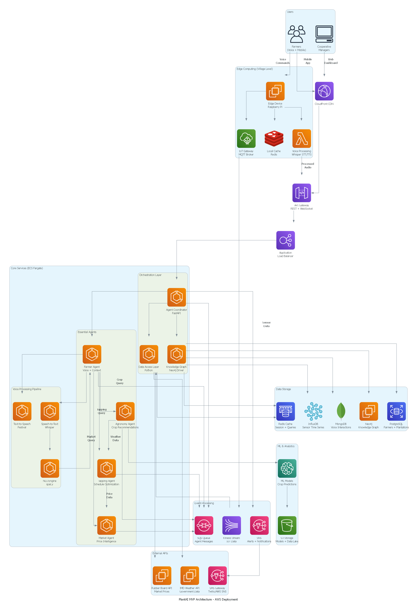
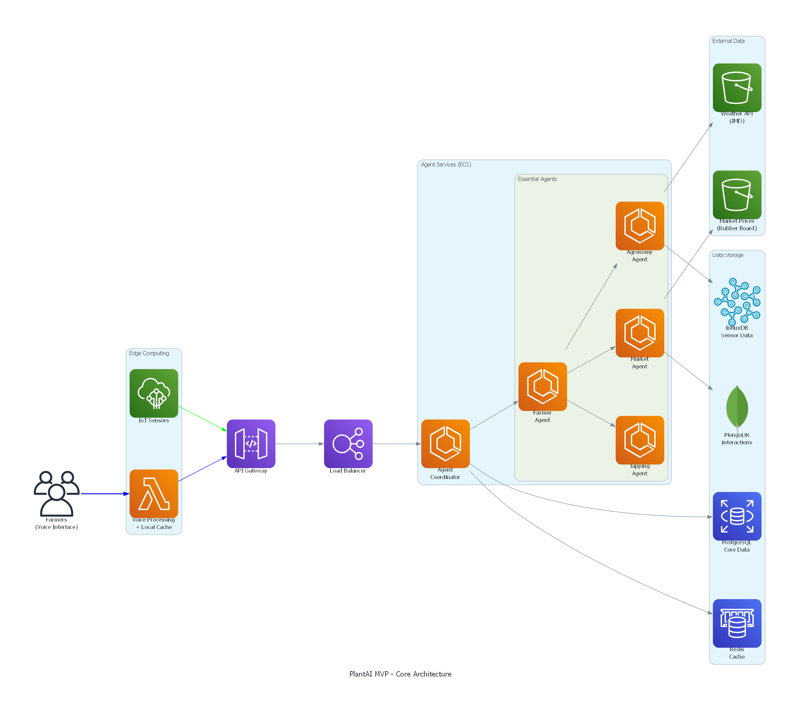
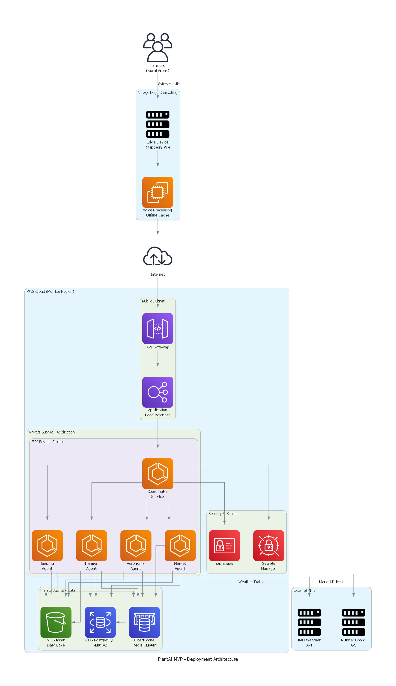

# PlantAI Architecture Diagram Generator

This directory contains Python scripts to generate AWS architecture diagrams for the PlantAI MVP system.

## Prerequisites

Install the required Python packages:

```bash
pip install diagrams
```

**Note**: The `diagrams` library requires Graphviz to be installed on your system.

### Installing Graphviz on Windows

**Option 1: Using Chocolatey (Recommended)**
```bash
choco install graphviz
```

**Option 2: Manual Installation**
1. Download Graphviz from: https://graphviz.org/download/
2. Install the Windows package
3. Add Graphviz to your PATH:
   - Default location: `C:\Program Files\Graphviz\bin`
   - Add this to your system PATH environment variable

**Option 3: Using Winget**
```bash
winget install graphviz
```

After installation, restart your terminal/command prompt.

## Available Diagram Scripts

### 1. Complete MVP Architecture (`generate_plantai_diagram.py`)
Generates a comprehensive diagram showing all components:
- Edge computing layer
- Core agent services
- Data storage layer
- ML & analytics
- External integrations

**Run:**
```bash
python generate_plantai_diagram.py
```

**Output:** `plantai_mvp_architecture.png`

### 2. Simplified Architecture (`generate_plantai_simple_diagram.py`)
Generates a clean, focused diagram showing core MVP components:
- Essential agents only
- Key data flows
- Simplified connections

**Run:**
```bash
python generate_plantai_simple_diagram.py
```

**Output:** `plantai_mvp_simple.png`

### 3. Deployment Architecture (`generate_plantai_deployment_diagram.py`)
Generates a deployment topology diagram showing:
- AWS VPC structure
- Public/Private subnets
- Edge computing deployment
- Security components

**Run:**
```bash
python generate_plantai_deployment_diagram.py
```

**Output:** `plantai_deployment.png`

## Quick Start

Run all diagram generators at once:

```bash
# Windows Command Prompt
python generate_plantai_diagram.py
python generate_plantai_simple_diagram.py
python generate_plantai_deployment_diagram.py

# Or create a batch file (run_all_diagrams.bat):
@echo off
echo Generating PlantAI Architecture Diagrams...
python generate_plantai_diagram.py
python generate_plantai_simple_diagram.py
python generate_plantai_deployment_diagram.py
echo.
echo All diagrams generated successfully!
pause
```

## Troubleshooting

### Error: "Graphviz executables not found"

**Solution:**
1. Verify Graphviz is installed: `dot -V`
2. If not found, install Graphviz (see prerequisites above)
3. Ensure Graphviz bin directory is in your PATH
4. Restart your terminal/IDE

### Error: "No module named 'diagrams'"

**Solution:**
```bash
pip install diagrams
```

### Diagrams appear blank or corrupted

**Solution:**
1. Update Graphviz to the latest version
2. Try regenerating with: `python -m diagrams <script_name>.py`
3. Check if PNG files are being created in the current directory

## Customization

You can customize the diagrams by editing the Python scripts:

- **Colors**: Modify `Edge(color="blue")` parameters
- **Layout**: Change `direction="TB"` to `"LR"` (left-to-right) or `"BT"` (bottom-to-top)
- **Spacing**: Adjust `graph_attr` settings like `nodesep` and `ranksep`
- **Components**: Add/remove AWS services from the diagrams

## Output Files

After running the scripts, you'll find these PNG files:
- `plantai_mvp_architecture.png` - Complete architecture
- `plantai_mvp_simple.png` - Simplified view
- `plantai_deployment.png` - Deployment topology

These can be included in documentation, presentations, or technical specifications.

## Integration with Documentation

To include these diagrams in your markdown documentation:

```markdown





```

## Additional Resources

- [Diagrams Documentation](https://diagrams.mingrammer.com/)
- [Graphviz Documentation](https://graphviz.org/documentation/)
- [AWS Architecture Icons](https://aws.amazon.com/architecture/icons/)

## License

These diagram generators are part of the PlantAI project documentation.
