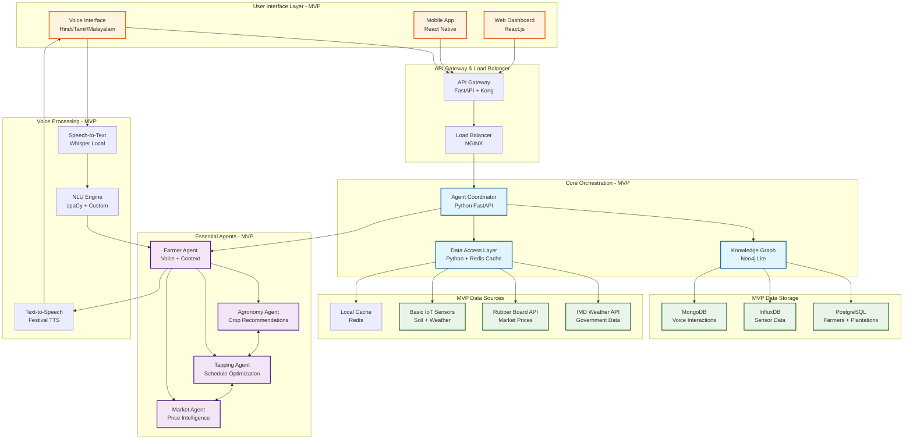
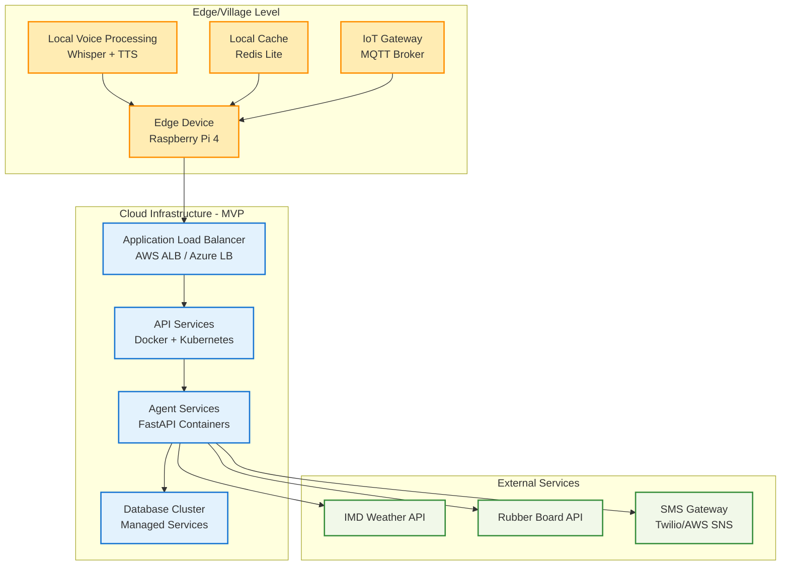
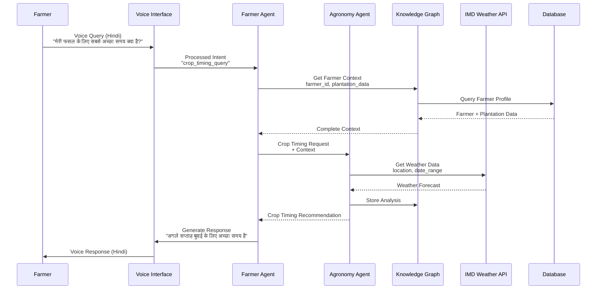

# PlantAI MVP Architecture Diagram

## MVP Architecture Overview

This diagram shows the simplified architecture for the PlantAI MVP, focusing on core functionality needed for the initial deployment with rubber plantation farmers.

## MVP Technology Stack

### Backend Services
- **Language**: Python 3.9+
- **Framework**: FastAPI with async/await
- **Agent Framework**: Custom Python classes with direct messaging
- **API Gateway**: Kong or AWS API Gateway
- **Load Balancer**: NGINX

### Voice Processing
- **Speech-to-Text**: OpenAI Whisper (local deployment)
- **NLU**: spaCy with custom agricultural models
- **Text-to-Speech**: Festival TTS with Hindi/Tamil/Malayalam support
- **Offline Support**: Local models cached on edge devices

### Data Storage
- **Primary Database**: PostgreSQL 14+ (farmers, plantations, equipment)
- **Time Series**: InfluxDB 2.0 (sensor data, weather data)
- **Document Store**: MongoDB 5.0 (voice interactions, unstructured data)
- **Graph Database**: Neo4j Community Edition (relationships)
- **Cache**: Redis 6.0+ (session data, frequent queries)

### Frontend Applications
- **Mobile App**: React Native 0.72+ (iOS/Android)
- **Web Dashboard**: React.js 18+ with TypeScript
- **Voice Interface**: WebRTC for real-time audio streaming

### External Integrations
- **Weather Data**: India Meteorological Department (IMD) API
- **Market Data**: Rubber Board of India API
- **IoT Sensors**: Basic soil moisture, temperature, humidity sensors
- **Authentication**: OAuth 2.0 with JWT tokens

## MVP Deployment Architecture

## MVP Data Flow

## MVP Simplifications

### Reduced Scope for MVP
1. **Languages**: Start with 3 languages (Hindi, Tamil, Malayalam) instead of 6
2. **Agents**: Implement 4 core agents instead of 6 (skip Community and Climate for MVP)
3. **Data Sources**: Focus on essential APIs (IMD, Rubber Board) and basic IoT sensors
4. **Deployment**: Single-region deployment instead of multi-region
5. **Features**: Core voice interaction and basic recommendations only

### MVP Success Criteria
- **Performance**: <5 seconds voice response (relaxed from <3 seconds)
- **Accuracy**: >85% speech recognition (relaxed from >95%)
- **Users**: 100+ farmers in pilot (reduced from 1000+)
- **Uptime**: 95% availability (relaxed from 99.5%)
- **Languages**: 3 Indian languages with basic dialect support

### Post-MVP Expansion Path
1. **Phase 2**: Add Community and Climate agents
2. **Phase 3**: Expand to 6 languages with full dialect support
3. **Phase 4**: Add satellite imagery and advanced IoT integration
4. **Phase 5**: Multi-region deployment and scaling to 1000+ farmers

This MVP architecture provides a solid foundation while being achievable for initial deployment and testing with rubber plantation farmers.