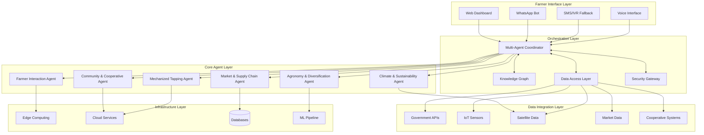
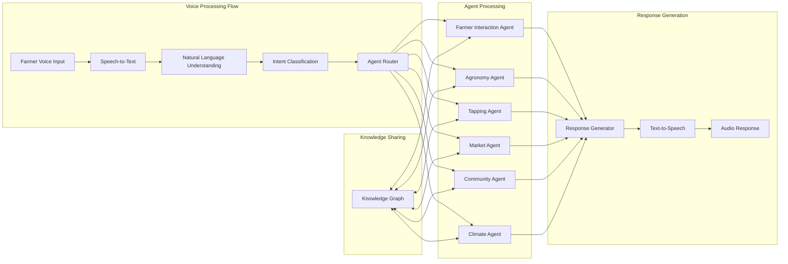
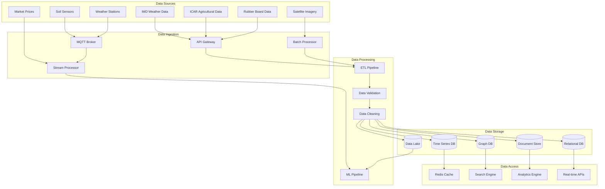
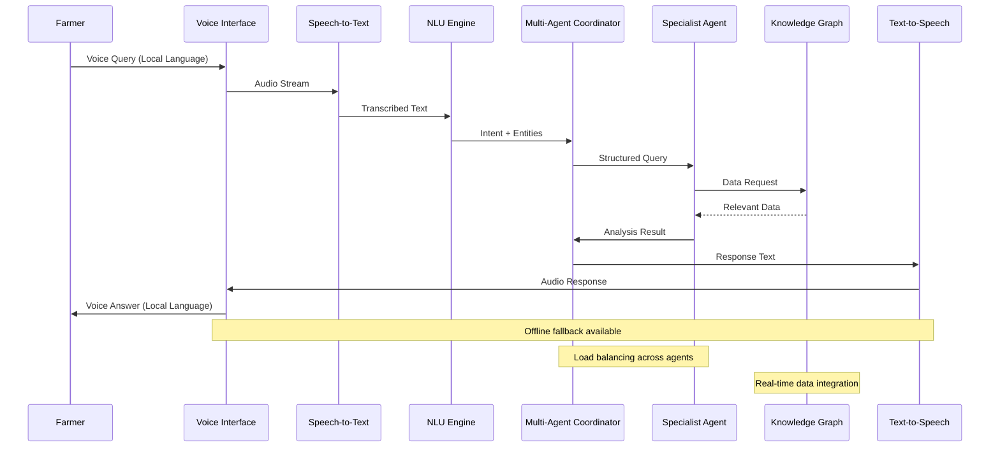
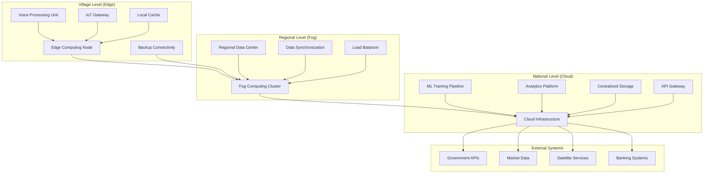
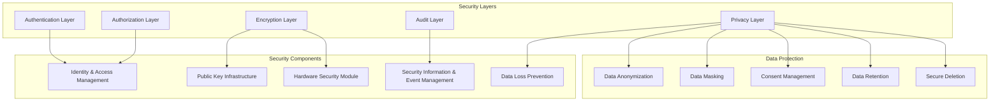
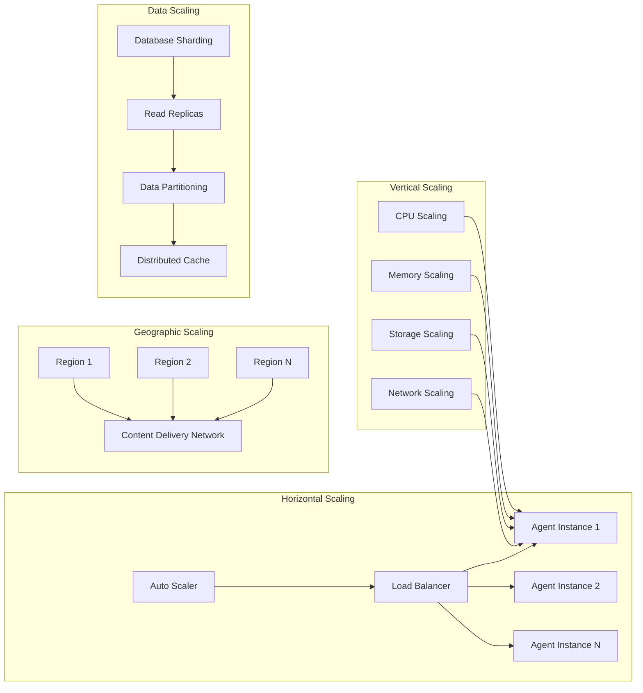
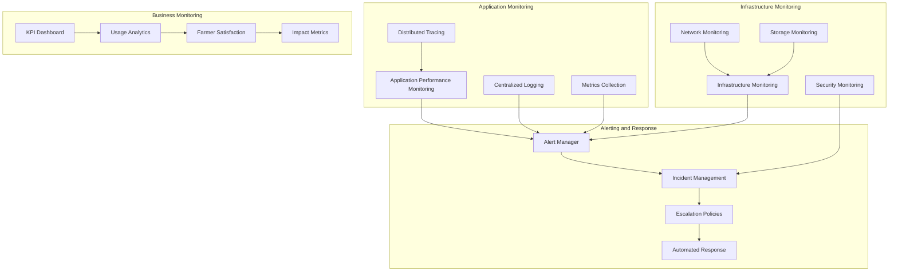
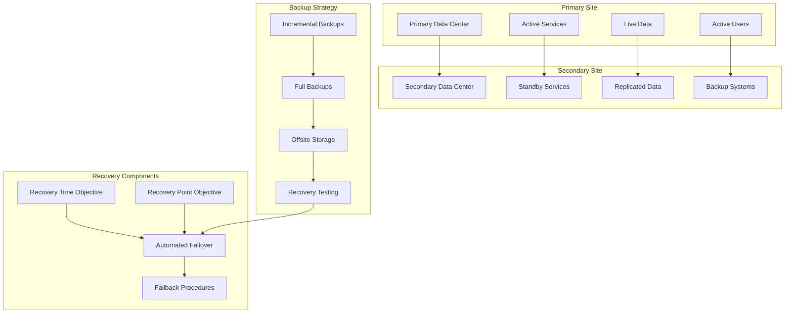

# PlantAI System Architecture
## Multi-Agent Architecture for Plantation Rejuvenation

### Document Overview
This document provides detailed system architecture diagrams and technical specifications for the PlantAI multi-agent system, including component interactions, data flows, and deployment architecture.

---

## 1. High-Level System Architecture

---

## 2. Agent Interaction Architecture

---

## 3. Data Flow Architecture

---

## 4. Voice Processing Architecture

---

## 5. Deployment Architecture

---

## 6. Security Architecture

---

## 7. Scalability Architecture

---

## 8. Integration Architecture

```mermaid
graph TB
    subgraph "PlantAI Core"
        CORE[PlantAI Platform]
        API[Internal APIs]
        AGENTS[Agent Framework]
    end
    
    subgraph "Government Integration"
        IMD[IMD Weather APIs]
        ICAR[ICAR Data APIs]
        RUBBER[Rubber Board APIs]
        AGRI[State Agriculture APIs]
        EGOV[e-Governance Portals]
    end
    
    subgraph "Financial Integration"
        BANK[Banking APIs]
        PAYMENT[Payment Gateways]
        INSURANCE[Insurance APIs]
        CREDIT[Credit Scoring APIs]
        SUBSIDY[Subsidy Management]
    end
    
    subgraph "Market Integration"
        COMMODITY[Commodity Exchanges]
        MANDI[Mandi Price APIs]
        EXPORT[Export Data APIs]
        LOGISTICS[Logistics APIs]
        QUALITY[Quality Certification]
    end
    
    subgraph "Technology Integration"
        IOT[IoT Platforms]
        SATELLITE[Satellite APIs]
        WEATHER[Weather Services]
        MAPS[Mapping Services]
        TELECOM[Telecom APIs]
    end
    
    CORE --> IMD
    CORE --> ICAR
    CORE --> RUBBER
    CORE --> AGRI
    CORE --> EGOV
    
    CORE --> BANK
    CORE --> PAYMENT
    CORE --> INSURANCE
    CORE --> CREDIT
    CORE --> SUBSIDY
    
    CORE --> COMMODITY
    CORE --> MANDI
    CORE --> EXPORT
    CORE --> LOGISTICS
    CORE --> QUALITY
    
    CORE --> IOT
    CORE --> SATELLITE
    CORE --> WEATHER
    CORE --> MAPS
    CORE --> TELECOM
```

---

## 9. Monitoring and Observability Architecture

---

## 10. Disaster Recovery Architecture

---

## 11. Technology Stack

### Frontend Technologies
- **Voice Interface**: WebRTC, Speech Recognition APIs
- **Mobile Apps**: React Native, Flutter
- **Web Dashboard**: React.js, Vue.js
- **Offline Support**: Service Workers, IndexedDB

### Backend Technologies
- **Agent Framework**: Python (FastAPI), Node.js
- **Message Queue**: Apache Kafka, RabbitMQ
- **API Gateway**: Kong, AWS API Gateway
- **Load Balancer**: NGINX, HAProxy

### Data Technologies
- **Time Series**: InfluxDB, TimescaleDB
- **Graph Database**: Neo4j, Amazon Neptune
- **Document Store**: MongoDB, Elasticsearch
- **Relational**: PostgreSQL, MySQL
- **Cache**: Redis, Memcached

### ML/AI Technologies
- **ML Framework**: TensorFlow, PyTorch
- **NLP**: spaCy, Transformers
- **Voice Processing**: Whisper, Festival TTS
- **Computer Vision**: OpenCV, YOLO

### Infrastructure Technologies
- **Containers**: Docker, Kubernetes
- **Cloud**: AWS, Azure, Google Cloud
- **Edge Computing**: AWS IoT Greengrass
- **Monitoring**: Prometheus, Grafana, ELK Stack

---

This architecture document provides the technical foundation for implementing the PlantAI multi-agent system with proper scalability, security, and integration capabilities.